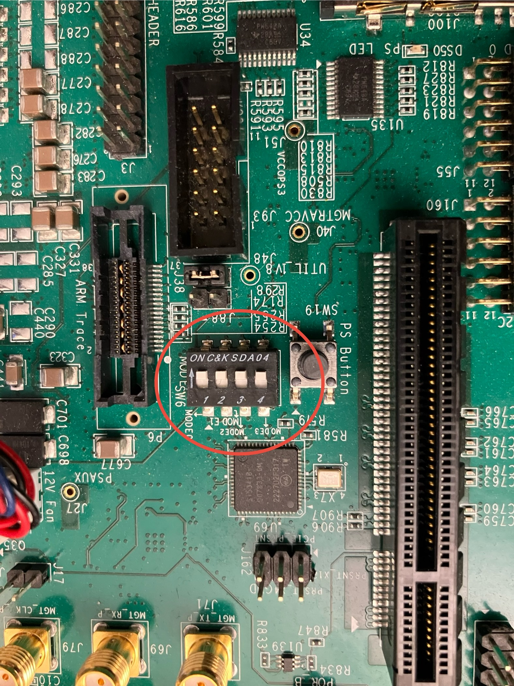
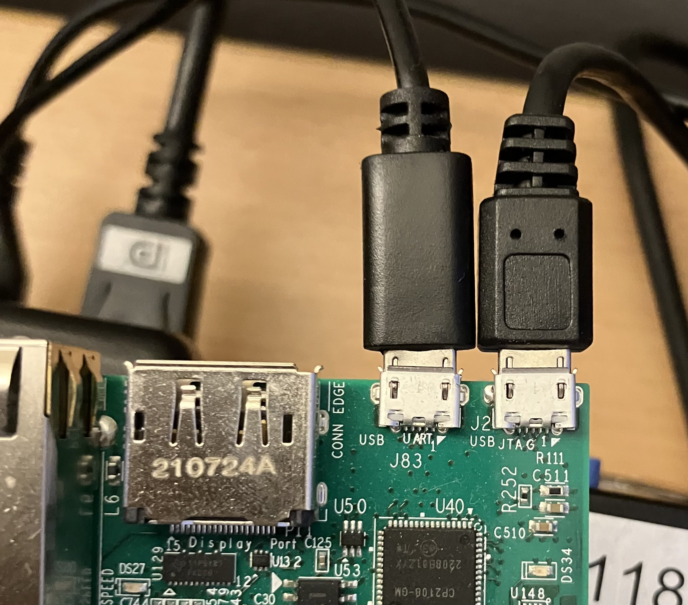
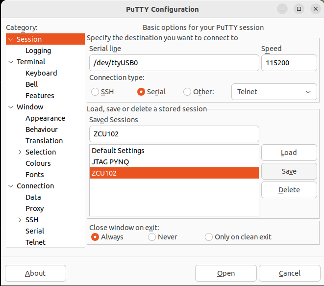
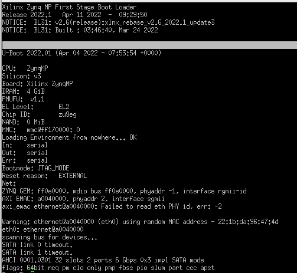
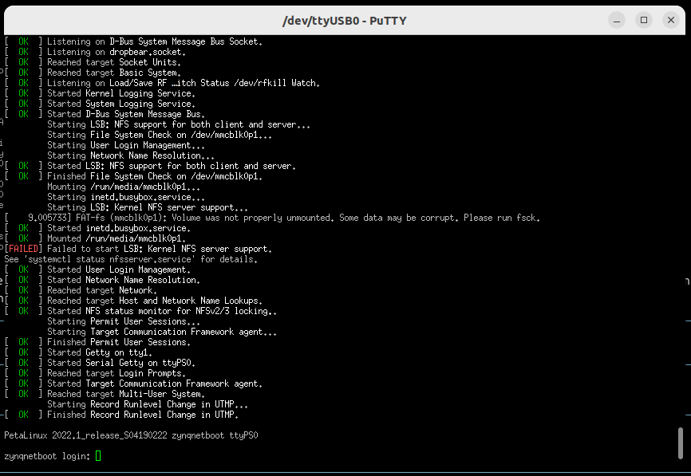
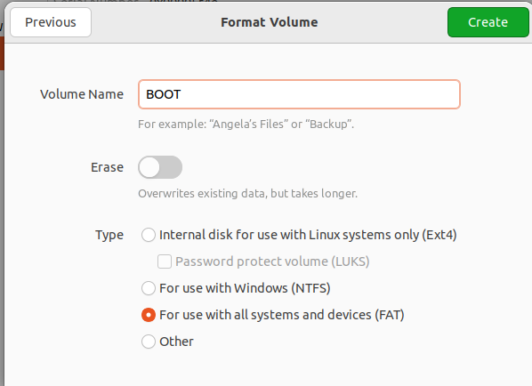
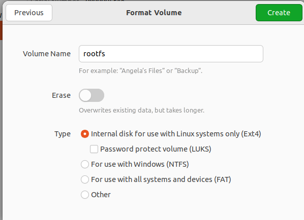
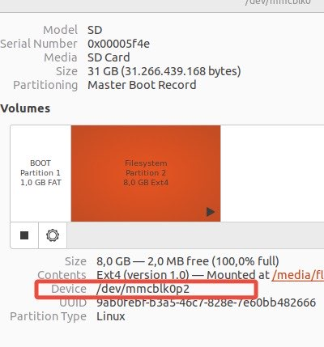
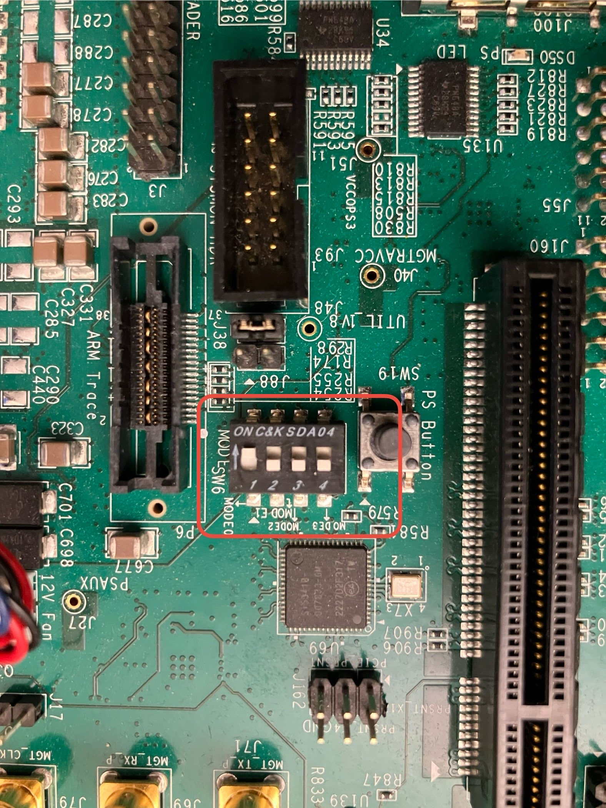

# ZCU102 PetaLinux Setup

This repository provides scripts and detailed instructions for configuring, building, and flashing PetaLinux using a custom exported hardware design.

Tested on Ubuntu 22.04.

## Setup Instructions

### 1. Download PetaLinux
- Download the PetaLinux installer from the official [Xilinx website (PetaLinux 2022.1)](https://www.xilinx.com/member/forms/download/xef.html?filename=petalinux-v2022.1-04191534-installer.run). This guide uses version 2022.1.

### 2. Prepare the Installation Directory
- Copy the installer to the desired installation folder. In this guide, we use `/opt/Xilinx/Petalinux` as the target directory.

### 3. Install PetaLinux
- First, install the required prerequisite packages:

    ```bash
    sudo apt-get install gcc-multilib

    # Add support for i386 packages
    sudo dpkg --add-architecture i386

    sudo apt-get install zlib1g:i386

    sudo apt-get install texinfo
    ```

> **Note**: Depending on your system, additional packages may be required.

### 4. Install PetaLinux
- **Important**: The PetaLinux installer will extract its files into the **current directory** without creating subdirectories. Make sure you are in the desired target directory before running the installer.

To install PetaLinux, run the following commands:

```bash
chmod +x petalinux-v2022.1-04191534-installer.run
./petalinux-v2022.1-04191534-installer.run
```
### 4. Configure PetaLinux

- To configure, build, and flash PetaLinux, you must first source the PetaLinux environment setup script:

    ```bash
    source /opt/Xilinx/Petalinux/settings.sh
    ```

- Navigate to the directory where you want to create your project and run the following commands:

    ```bash
    cd projectfolder
    source /opt/Xilinx/Petalinux/settings.sh

    # For Ultrascale+ devices, use 'zynqMP', and for Zynq-7000, use 'zynq'
    petalinux-create --type project --template zynqMP --name projectName
    cd projectfolder
    ```

---

### 5. Import Hardware Description and Customize the Build

- Import your exported hardware description file (refer to the other repository for details):

    ```bash
    petalinux-config --get-hw-description zcu_102_sgmii_sfp.xsa
    ```

- Now, you can customize your PetaLinux build. For instance, to select the `axi_eth` network interface, navigate through the configuration menu:

    ```text
    Subsystem AUTO Hardware Settings -> Ethernet Settings -> Primary Ethernet -> axi_eth
    ```

    

- To adjust the root filesystem settings, navigate to:

    ```text
    Image Packaging Configuration -> Root Filesystem -> Select Type (EXT4 (SD/eMMC/SATA/USB))
    ```

    - For the device node, select `/dev/mmcblk0p2`, which represents the second partition on the SD card. (You may need to insert the SD card and manually create the two partitions, as detailed in Step 10.) With this selection all the data created within the petalinux instance is stored on the second SD-card partition.

- If you do **not** wish to use a TFTP server, disable the option to *"Copy final images to tftpboot directory"* by pressing `n`.


Finally press Save and Exit.


### 6. Configure U-Boot for SD Card Support

- To configure U-Boot, run the following command:

    ```bash
    petalinux-config -c u-boot
    ```

- Enable SD Card support by navigating through the menu:

    ```text
    Boot Options -> Media -> SD Support for booting from SD/EMMC
    ```


- Press `y` to enable SD Card support.


### 7. Add a Custom Application

You can add a custom application to your PetaLinux project by creating a new one with the following command:

```bash
$ petalinux-create -t apps --template c++ --name myapp --enable
```
This command creates an application named *myapp.* Apps must be in lowercase letters otherwise the warning: 

```
WARNING: QA Issue: PN: embeddedRTPS is upper case, this can result in unexpected behavior. [uppercase-pn]
```

pops up. 

The relevant files will be located in the following directory:

```bash
./project-spec/meta-user/recipes-apps/myapp
```

Within the `myapp.bb` file (the recipe file for the application), you can specify various settings for your app. Below is an example of the contents:
```c++
#
# This file is the myapp recipe.
#

SUMMARY = "Simple emyapp application"
SECTION = "PETALINUX/apps"
LICENSE = "MIT"
LIC_FILES_CHKSUM = "file://${COMMON_LICENSE_DIR}/MIT;md5=0835ade698e0bcf8506ecda2f7b4f302"

SRC_URI = "file://myapp.cpp \
           file://Makefile \
		  "

S = "${WORKDIR}"

do_compile() {
	     oe_runmake
}

do_install() {
	     install -d ${D}${bindir}
	     install -m 0755 myapp ${D}${bindir}
}
```

In the files directory, you will find `myapp.cpp` and a `Makefile` that you can modify to configure your application.

### 7 . Configure the kernel

By executing the following command, the linux kernel can be configured:

```bash
$ petalinux-config -c kernel
```

For now we do not change anything here and just keep the default values. Anyway it is worth to scroll through the menues. 


### 6. Configure Root Filesystem (RootFS)

To configure the root filesystem, run the following command:

```bash
$ petalinux-config -c rootfs
```

To add our previously created application go to:

```bash
Under apps -> myapp 
```

Here, you can select the previously created `myapp` application, which will then be automatically compiled and included in the build image.


Additionally, you can select other packages under PetaLinux Package Groups, such as support for X11, Qt, or Python.

### 7. Build PetaLinux

No as we have configured all settings, you can build Petalinux by executing

```bash
$ petalinux-build

[INFO] Sourcing buildtools
[INFO] Building project
[INFO] Sourcing build environment
[INFO] Generating workspace directory
INFO: bitbake petalinux-image-minimal
NOTE: Started PRServer with DBfile: /home/florianfrank/Documents/asoa_package_filtering_root/zcu_102_petalinux_setup/zynq_netboot/build/cache/prserv.sqlite3, Address: 127.0.0.1:43887, PID: 275754
WARNING: Host distribution "ubuntu-22.04" has not been validated with this version of the build system; you may possibly experience unexpected failures. It is recommended that you use a tested distribution.
Loading cache: 100% |##############################################################################################################################################################| Time: 0:00:00
Loaded 5391 entries from dependency cache.
Parsing recipes: 100% |############################################################################################################################################################| Time: 0:00:00
Parsing of 3594 .bb files complete (3589 cached, 5 parsed). 5396 targets, 509 skipped, 0 masked, 0 errors.
NOTE: Resolving any missing task queue dependencies
#########################################################################################################################################################| Time: 0:00:06
INFO: Successfully copied built images to tftp dir: /var/lib/tftpboot
[INFO] Successfully built project
```

You should see the following output. In this example, the TFTP boot option was enabled, which automatically copies the build artifacts to `/var/lib/tftpboot`.

Additionally, a directory `/images/linux/` should now be present, containing all the necessary build files.

### 9. Create a bootable package

In a next step all files to boot the system must be created. To do this the following command must be executed: 

```bash
$ petalinux-package --boot --u-boot images/linux/u-boot.elf --dtb images/linux/system.dtb --fsbl images/linux zynqmp_fsbl.elf --fpga images/linux/system.bit
```

This command creates a `BOOT.BIN`it will fail if you rebuild the system and a BOOT.BIN is already available. 
Therefore you can simply excute the script: 

```bash
$ ../build_boot.sh
```

In your default project folder. It will remove the previous `BOOT.bin` and create a new one.


### 8. Booting the device

There are several options for booting your device. We will cover three methods: 

1. Using JTAG and the hardware server.
2. Booting from an SD card.
3. Booting via TFTP with NFS as the root filesystem.

#### 8.1 Boot Petalinux via JTAG 

When booting the device via JTAG, ensure you are in the current project folder.

First, verify that Vivado is not running with an active connection to the hardware server. If Vivado is open and connected, navigate to the **Hardware Manager** and disconnect the device.


Afterwards start your hardware server by executing

```bash
$ /opt/Xilinx/Petalinux/tools/xsct/bin/hw_server
```

Do this in a seperate tab because the application blocks the terminal. 

Afterwards set the ZCU102 in JTAG mode by setting the Pins SW6 to 0000. 




Afterwards connect the UART and JTAG pin by by a micro USB cable to your PC. 
You should see multipe UART ports. In our case /dev/ttyUSB0 to /dev/ttyUSB3.



Connect with a tool of your choice to /dev/ttyUSB0 with following parameters: 

- Baudrate: 115200
- Stopbits: 1
- Bitwidth: 8 Bit.
- Parity: None

We used putty configured as follows and pressed connect. 




Afterwards return to the project folder and execute the following command in your project folder:

```bash
$ petalinux-boot --jtag --fpga --kernel --hw_server-url TCP:127.0.0.1:3121

[INFO] Sourcing buildtools
INFO: Use bitstream: "/home/florianfrank/Documents/asoa_package_filtering_root/zcu_102_petalinux_setup/zynq_netboot/images/linux/system.bit.
INFO: Please use --fpga --bitstream <BITSTREAM> to specify a bitstream if you want to use other bitstream.
INFO: Launching XSDB for file download and boot.
INFO: This may take a few minutes, depending on the size of your image.
rlwrap: warning: your $TERM is 'xterm-256color' but rlwrap couldn't find it in the terminfo database. Expect some problems.: Inappropriate ioctl for device
INFO: Configuring the FPGA...                                                                                                                                                                                                                 
INFO: Downloading bitstream: /home/florianfrank/Documents/asoa_package_filtering_root/zcu_102_petalinux_setup/zynq_netboot/images/linux/system.bit to the target.
INFO: Downloading ELF file: /home/florianfrank/Documents/asoa_package_filtering_root/zcu_102_petalinux_setup/zynq_netboot/images/linux/pmufw.elf to the target.                                                                               
INFO: Downloading ELF file: /home/florianfrank/Documents/asoa_package_filtering_root/zcu_102_petalinux_setup/zynq_netboot/images/linux/zynqmp_fsbl.elf to the target.                                                                         
INFO: Loading image: /home/florianfrank/Documents/asoa_package_filtering_root/zcu_102_petalinux_setup/zynq_netboot/images/linux/system.dtb at 0x00100000                                                                                      
INFO: Downloading ELF file: /home/florianfrank/Documents/asoa_package_filtering_root/zcu_102_petalinux_setup/zynq_netboot/images/linux/u-boot.elf to the target.                                                                              
INFO: Loading image: /home/florianfrank/Documents/asoa_package_filtering_root/zcu_102_petalinux_setup/zynq_netboot/images/linux/Image at 0x00200000                                                                                           
INFO: Loading image: /home/florianfrank/Documents/asoa_package_filtering_root/zcu_102_petalinux_setup/zynq_netboot/images/linux/boot.scr at 0x20000000                                                                                        
INFO: Downloading ELF file: /home/florianfrank/Documents/asoa_package_filtering_root/zcu_102_petalinux_setup/zynq_netboot/images/linux/bl31.elf to the target.
INFO: Enter booti 0x00200000 - 0x00100000 in uboot terminal if auto boot fails       
```

This will take a while. Afterwards you can see output on the putty console. 




Note that the root file system must be selected to `INTRMFS` when ext (eMMC) is selected a SD card must be preseent. 
If the SD card is present as explained in the next step, the following command starts the operating system

```
zynq> boot
```

When the kernel is bootet the console should look the following: 

When you log in for the first time use the username *petalinux*, you will directly need to change the password. 




####  8.1 Booting Petalinux via SD Card

##### 8.1.1 Partition the SD-Card

You need a SD card with at least 8 GB of Space. 

Partition your SD card the following: 
- **Partition 1**: 
    - Size: 1 GB
    - Format FAT
    - name: BOOT
- **Partition 2**: 
    - Size: at least 7 GB
    - Format: ext4
    - name rootfs

You can use the Ubuntu Disk Utility to do that: 





Afterwards please check the name of the device file for the second partition, as marked with a red rectangle: 



##### 8.1.1 Copy files to the SD-Card

The following files from `image/linux` must be copied to the BOOT partition: 

- **BOOT.BIN:** Boot image contains following crucial components: 
    - **First Stage Bootloader (FSBL):** Initializes Hardware components such as memory, clock configuration peripherals and loads the next stage in the boot process (in our case the u-boot bootloader).
    - **Bitstream:** Contains the previous selected bitstream flashing the design on the PL. (In our case, if you see the lEDs next to SW13 blinking, the bitstream was sucessfully flashed to the device.)
    - **U-Boot:** Secondary bootloader whcih is loading the linux kernel, device tree and root file system

- **boot.scr:** Contains the boot commands writen to the u-boot bootloader. You can open the file with your text editor and have a look there and will find a specification of the used files, as well as the boot order and boot targets, such as mmc0 and mmc1 for the SD-Card, jtag, or QSPI

    ```
    fitimage_name=image.ub
    kernel_name=Image
    ramdisk_name=ramdisk.cpio.gz.u-boot
    rootfs_name=rootfs.cpio.gz.u-boot


    for boot_target in ${boot_targets};
    do
        echo "Trying to load boot images from ${boot_target}"
        if test "${boot_target}" = "jtag" ; then
            booti 0x00200000 0x04000000 0x00100000
        fi
        if test "${boot_target}" = "mmc0" || test "${boot_target}" = "mmc1" || test "${boot_target}" = "usb0" || test "${boot_target}" = "usb1"; then
            if test -e ${devtype} ${devnum}:${distro_bootpart} /uEnv.txt; then
                fatload ${devtype} ${devnum}:${distro_bootpart} 0x00200000 uEnv.txt;
                echo "Importing environment(uEnv.txt) from ${boot_target}..."
                env import -t 0x00200000 $filesize
                if test -n $uenvcmd; then
                    echo "Running uenvcmd ...";
                    run uenvcmd;
                fi
            fi
        ....
    ```

- **image.ub:** Flattened Image Tree File it packages multiple boot components (kernel, device tree, etc. )
    - Contains following components: 
        - The Linux kernel
        - Device Tree Blob: Binary description of the hardware like processors and peripherals required fo rthe kernel to understand the specific board configuration
        - Initramfs (optional): temporary root file system loaded into the memory and used for kernel during boot before actual root filesystem is mounted. 

To copy these files you can use a simple cp command or you can execute our script: 

```bash
$ ./create_sd_card.sh
```

This script will also create the root file system, which can either be unpacked on the rootfs partition of the SD-card by copying rootfs.tar.gz and unzipping it: 

```bash
$ tar xvzf rootfs.tar.gz
```

Or as part of the create_sd_card script, you can use the dd command to create a image: 

```bash
sudo dd if=images/linux/rootfs.ext4 of=/dev/mmcblk0p2 status=progress
```

Therefore make sure the device file `/dev/mmcblk0p2` matches with the device file of the second SD-Card partition.

##### 8.1.2 Boot from the SD card 

To do this, first put SW6 in boot mode by selecting 0111 as showin in the following figure: 


 
 Afterwards insert the SD card, power on the board by switching SW1 and you can continue interacting via the UART console, as described in Section 8.1. 
