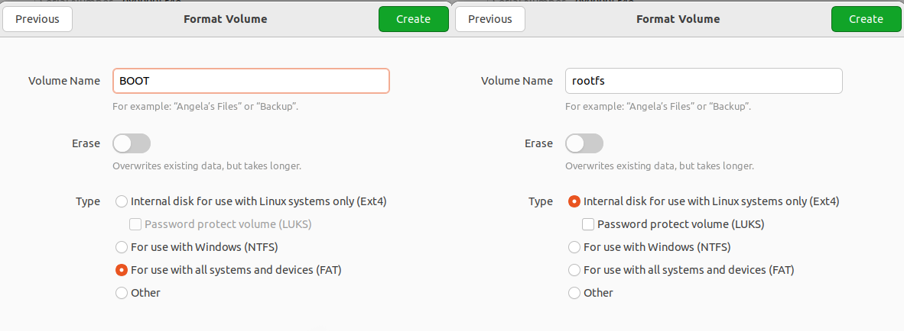

# ZCU102 PetaLinux Setup

This repository provides scripts and detailed instructions for configuring, building, and flashing PetaLinux using a custom exported hardware design.

Tested on Ubuntu 22.04.

## Setup Instructions

### 1. Download PetaLinux
- Download the PetaLinux installer from the official [Xilinx website (PetaLinux 2022.1)](https://www.xilinx.com/member/forms/download/xef.html?filename=petalinux-v2022.1-04191534-installer.run). This guide uses version 2022.1.

### 2. Prepare the Installation Directory
- Copy the installer to the desired installation folder. In this guide, we use `/opt/Xilinx/Petalinux` as the target directory.

### 3. Install PetaLinux
- First, install the required prerequisite packages:

    ```bash
    sudo apt-get install gcc-multilib

    # Add support for i386 packages
    sudo dpkg --add-architecture i386

    sudo apt-get install zlib1g:i386

    sudo apt-get install texinfo
    ```

> **Note**: Depending on your system, additional packages may be required.

### 4. Install PetaLinux
- **Important**: The PetaLinux installer will extract its files into the **current directory** without creating subdirectories. Make sure you are in the desired target directory before running the installer.

To install PetaLinux, run the following commands:

```bash
chmod +x petalinux-v2022.1-04191534-installer.run
./petalinux-v2022.1-04191534-installer.run
```
### 4. Configure PetaLinux

- To configure, build, and flash PetaLinux, you must first source the PetaLinux environment setup script:

    ```bash
    source /opt/Xilinx/Petalinux/settings.sh
    ```

- Navigate to the directory where you want to create your project and run the following commands:

    ```bash
    cd projectfolder
    source /opt/Xilinx/Petalinux/settings.sh

    # For Ultrascale+ devices, use 'zynqMP', and for Zynq-7000, use 'zynq'
    petalinux-create --type project --template zynqMP --name projectName
    cd projectfolder
    ```

---

### 5. Import Hardware Description and Customize the Build

- Import your exported hardware description file (refer to the following [repository](https://fimgit.fim.uni-passau.de/frankfl/zcu_102_gmii_sfp) for details):

    ```bash
    petalinux-config --get-hw-description zcu_102_sgmii_sfp.xsa
    ```

- Now, you can customize your PetaLinux build. For instance, to select the `axi_eth` network interface, navigate through the configuration menu:

    ```text
    Subsystem AUTO Hardware Settings -> Ethernet Settings -> Primary Ethernet -> axi_eth
    ```

    

- To adjust the root filesystem settings, navigate to:

    ```text
    Image Packaging Configuration -> Root Filesystem -> Select Type (EXT4 (SD/eMMC/SATA/USB))
    ```

    - For the device node, select `/dev/mmcblk0p2`, which represents the second partition on the SD card. (You may need to insert the SD card and manually create the two partitions, as detailed in Step 8.1) With this selection all the data created within the petalinux instance is stored on the second SD-card partition.

- If you do **not** wish to use a TFTP server, disable the option to *"Copy final images to tftpboot directory"* by pressing `n`.


Finally save the configiguration and exit the menu.


### 6. Configure U-Boot for SD Card Support

- To configure U-Boot, run the following command:

    ```bash
    petalinux-config -c u-boot
    ```

- Enable SD Card support by navigating through the menu:

    ```text
    Boot Options -> Media -> SD Support for booting from SD/EMMC
    ```


- Press `y` to enable SD Card support.


### 7. Add a Custom Application

To add a custom application to your PetaLinux project, use the following command:

```bash
$ petalinux-create -t apps --template c++ --name myapp --enable
```

This command creates an application named `myapp`. Ensure the application name is in lowercase to avoid potential warnings like:

```
WARNING: QA Issue: PN: embeddedRTPS is upper case, this can result in unexpected behavior. [uppercase-pn]
```

The generated files for your application will be located in:

```bash
./project-spec/meta-user/recipes-apps/myapp
```

Within the `myapp.bb` file (the BitBake recipe for your application), you can configure various build settings. Below is an example of the contents:

```c++
#
# This file is the myapp recipe.
#

SUMMARY = "Simple emyapp application"
SECTION = "PETALINUX/apps"
LICENSE = "MIT"
LIC_FILES_CHKSUM = "file://${COMMON_LICENSE_DIR}/MIT;md5=0835ade698e0bcf8506ecda2f7b4f302"

SRC_URI = "file://myapp.cpp \
           file://Makefile \
		  "

S = "${WORKDIR}"

do_compile() {
	     oe_runmake
}

do_install() {
	     install -d ${D}${bindir}
	     install -m 0755 myapp ${D}${bindir}
}
```

In the files directory, you will find `myapp.cpp` and a `Makefile` that you can modify to configure your application.

### 7 . Configure the kernel

To configure the Linux kernel in your PetaLinux project, use the following command:

```bash
$ petalinux-config -c kernel
```

This command opens the kernel configuration menu. For now, we will leave all settings at their default values. However, it's worth taking the time to explore the various menus to familiarize yourself with the available options.

### 6. Configure Root Filesystem (RootFS)

To configure the root filesystem, run the following command:

```bash
$ petalinux-config -c rootfs
```

To include the custom application created earlier (e.g., `myapp`), navigate to:


```bash
Under apps -> myapp 
```

Select `myapp` to ensure it is automatically compiled and included in the build image.


Additionally, you can select other packages under PetaLinux Package Groups, such as support for X11, Qt, or Python.

### 7. Build PetaLinux

Now that all settings have been configured, you can build the PetaLinux project by running the following command:


```bash
$ petalinux-build

[INFO] Sourcing buildtools
[INFO] Building project
[INFO] Sourcing build environment
[INFO] Generating workspace directory
INFO: bitbake petalinux-image-minimal
NOTE: Started PRServer with DBfile: /home/florianfrank/Documents/asoa_package_filtering_root/zcu_102_petalinux_setup/zynq_netboot/build/cache/prserv.sqlite3, Address: 127.0.0.1:43887, PID: 275754
WARNING: Host distribution "ubuntu-22.04" has not been validated with this version of the build system; you may possibly experience unexpected failures. It is recommended that you use a tested distribution.
Loading cache: 100% |##############################################################################################################################################################| Time: 0:00:00
Loaded 5391 entries from dependency cache.
Parsing recipes: 100% |############################################################################################################################################################| Time: 0:00:00
Parsing of 3594 .bb files complete (3589 cached, 5 parsed). 5396 targets, 509 skipped, 0 masked, 0 errors.
NOTE: Resolving any missing task queue dependencies
#########################################################################################################################################################| Time: 0:00:06
INFO: Successfully copied built images to tftp dir: /var/lib/tftpboot
[INFO] Successfully built project
```

You should see the following output. In this example, the TFTP boot option was enabled, which automatically copies the build artifacts to `/var/lib/tftpboot`.

Additionally, a new directory named `/images/linux/` will be created, containing all the necessary build files for your project.

### 9. Create a bootable package

To generate all the necessary files for booting the system, run the following command:

```bash
$ petalinux-package --boot --u-boot images/linux/u-boot.elf --dtb images/linux/system.dtb --fsbl images/linux zynqmp_fsbl.elf --fpga images/linux/system.bit
```

This command creates the `BOOT.BIN` file. However, if a `BOOT.BIN` already exists (for example, after rebuilding the system), the command will fail.

To handle this, you can run the following script from your default project folder to automatically remove the previous BOOT.BIN and generate a new one:

```bash
$ ../build_boot.sh
```

This script ensures that any old `BOOT.BIN` is deleted before creating a new one, preventing build errors.

### 8. Booting the device

# Booting the Device

There are several methods to boot your device. Below, we outline three common approaches:

1. **Booting with JTAG and the Hardware Server**  
   This method uses JTAG and the hardware server to load and run the system directly from your host machine.

2. **Booting from an SD Card**  
   You can boot your system by creating a bootable SD card containing the required files, such as `BOOT.BIN` and the root filesystem.

3. **Booting via TFTP with NFS as the Root Filesystem**  
   This method involves using TFTP to load the kernel and using NFS to mount the root filesystem over the network.

Each method offers different advantages depending on your setup and requirements.

#### 8.1 Boot Petalinux via JTAG 

To boot your device via JTAG, follow these steps. Make sure you are in your current project folder.

Before proceeding, ensure that **Vivado** is not running an active connection to the hardware server. If Vivado is open and connected, go to the **Hardware Manager** and disconnect the device.


Afterwards, launch the hardware server by running the following command:

```bash
$ /opt/Xilinx/Petalinux/tools/xsct/bin/hw_server
```

> **Note**: Run this command in a separate terminal tab because the hardware server process blocks the terminal.

To configure the ZCU102 for JTAG boot, set the **SW6** pins to `0000`, as shown in the following figure.


After setting the device to JTAG mode, connect **UART** and **JTAG** to your PC using a micro USB cable. You should see multiple UART ports, typically `/dev/ttyUSB0` through `/dev/ttyUSB3`.


Use a terminal tool of your choice to connect to `/dev/ttyUSB0` with the following configuration:

- **Baudrate**: 115200
- **Stopbits**: 1
- **Data Bits**: 8 bits
- **Parity**: None

In this example, we used **PuTTY**, configured as shown below, and pressed "Connect":


Afterwards return to the project folder and execute the following command in your project folder:

```bash
$ petalinux-boot --jtag --fpga --kernel --hw_server-url TCP:127.0.0.1:3121

[INFO] Sourcing buildtools
INFO: Use bitstream: "/home/florianfrank/Documents/asoa_package_filtering_root/zcu_102_petalinux_setup/zynq_netboot/images/linux/system.bit.
INFO: Please use --fpga --bitstream <BITSTREAM> to specify a bitstream if you want to use other bitstream.
INFO: Launching XSDB for file download and boot.
INFO: This may take a few minutes, depending on the size of your image.
rlwrap: warning: your $TERM is 'xterm-256color' but rlwrap couldn't find it in the terminfo database. Expect some problems.: Inappropriate ioctl for device
INFO: Configuring the FPGA...                                                                                                                                                                                                                 
INFO: Downloading bitstream: /home/florianfrank/Documents/asoa_package_filtering_root/zcu_102_petalinux_setup/zynq_netboot/images/linux/system.bit to the target.
INFO: Downloading ELF file: /home/florianfrank/Documents/asoa_package_filtering_root/zcu_102_petalinux_setup/zynq_netboot/images/linux/pmufw.elf to the target.                                                                               
INFO: Downloading ELF file: /home/florianfrank/Documents/asoa_package_filtering_root/zcu_102_petalinux_setup/zynq_netboot/images/linux/zynqmp_fsbl.elf to the target.                                                                         
INFO: Loading image: /home/florianfrank/Documents/asoa_package_filtering_root/zcu_102_petalinux_setup/zynq_netboot/images/linux/system.dtb at 0x00100000                                                                                      
INFO: Downloading ELF file: /home/florianfrank/Documents/asoa_package_filtering_root/zcu_102_petalinux_setup/zynq_netboot/images/linux/u-boot.elf to the target.                                                                              
INFO: Loading image: /home/florianfrank/Documents/asoa_package_filtering_root/zcu_102_petalinux_setup/zynq_netboot/images/linux/Image at 0x00200000                                                                                           
INFO: Loading image: /home/florianfrank/Documents/asoa_package_filtering_root/zcu_102_petalinux_setup/zynq_netboot/images/linux/boot.scr at 0x20000000                                                                                        
INFO: Downloading ELF file: /home/florianfrank/Documents/asoa_package_filtering_root/zcu_102_petalinux_setup/zynq_netboot/images/linux/bl31.elf to the target.
INFO: Enter booti 0x00200000 - 0x00100000 in uboot terminal if auto boot fails       
```

This process may take some time. Once completed, you should see output in the PuTTY console.


Ensure that the root filesystem is set to `INTRMFS`. If you select `ext (eMMC)`, an SD card must be present. As explained in the next step, if the SD card is correctly inserted, you can start the operating system with the following command:

```
zynq> boot
```

Once the kernel has booted, the console output should look like this:


When logging in for the first time, use the username `petalinux`. You will be prompted to change the password immediately.


####  8.1 Booting Petalinux via SD Card

##### 8.1.1 Partition the SD-Card

To boot PetaLinux from an SD card, you need a card with at least 8 GB of space. Follow these steps to partition the SD card:

- **Partition 1**:
  - **Size**: 1 GB
  - **Format**: FAT
  - **Name**: BOOT

- **Partition 2**:
  - **Size**: At least 7 GB
  - **Format**: ext4
  - **Name**: rootfs

You can use the Ubuntu Disk Utility to create these partitions:




After partitioning, check the name of the device file for the second partition. Look for the name marked with a red rectangle:


##### 8.1.1 Copy files to the SD-Card

The following files from `image/linux` must be copied to the BOOT partition: 

- **BOOT.BIN:** Boot image contains following crucial components: 
    - **First Stage Bootloader (FSBL):** Initializes Hardware components such as memory, clock configuration peripherals and loads the next stage in the boot process (in our case the u-boot bootloader).
    - **Bitstream:** Contains the previous selected bitstream flashing the design on the PL. (In our case, if you see the lEDs next to SW13 blinking, the bitstream was sucessfully flashed to the device.)
    - **U-Boot:** Secondary bootloader whcih is loading the linux kernel, device tree and root file system

- **boot.scr:** Contains the boot commands writen to the u-boot bootloader. You can open the file with your text editor and have a look there and will find a specification of the used files, as well as the boot order and boot targets, such as mmc0 and mmc1 for the SD-Card, jtag, or QSPI

    ```
    fitimage_name=image.ub
    kernel_name=Image
    ramdisk_name=ramdisk.cpio.gz.u-boot
    rootfs_name=rootfs.cpio.gz.u-boot


    for boot_target in ${boot_targets};
    do
        echo "Trying to load boot images from ${boot_target}"
        if test "${boot_target}" = "jtag" ; then
            booti 0x00200000 0x04000000 0x00100000
        fi
        if test "${boot_target}" = "mmc0" || test "${boot_target}" = "mmc1" || test "${boot_target}" = "usb0" || test "${boot_target}" = "usb1"; then
            if test -e ${devtype} ${devnum}:${distro_bootpart} /uEnv.txt; then
                fatload ${devtype} ${devnum}:${distro_bootpart} 0x00200000 uEnv.txt;
                echo "Importing environment(uEnv.txt) from ${boot_target}..."
                env import -t 0x00200000 $filesize
                if test -n $uenvcmd; then
                    echo "Running uenvcmd ...";
                    run uenvcmd;
                fi
            fi
        ....
    ```

- **image.ub:** Flattened Image Tree File it packages multiple boot components (kernel, device tree, etc. )
    - Contains following components: 
        - The Linux kernel
        - Device Tree Blob: Binary description of the hardware like processors and peripherals required fo rthe kernel to understand the specific board configuration
        - Initramfs (optional): temporary root file system loaded into the memory and used for kernel during boot before actual root filesystem is mounted. 

To copy these files, you can either use the `cp` command manually or execute our provided script:

```bash
$ ./create_sd_card.sh
```

This script will also create the root file system, which can either be unpacked on the rootfs partition of the SD-card by copying rootfs.tar.gz and unzipping it: 

```bash
$ tar xvzf rootfs.tar.gz
```

Or as part of the create_sd_card script, you can use the dd command to create a image: 

```bash
sudo dd if=images/linux/rootfs.ext4 of=/dev/mmcblk0p2 status=progress
```

>**Important**: Ensure that the device file `/dev/mmcblk0p2` corresponds to the second partition of your SD card.


##### 8.1.2 Boot from the SD card 

To boot from the SD card, follow these steps:

1. **Set SW6 to Boot Mode**: Configure SW6 to the `0111` position, as shown in the figure below:

    

2. **Insert the SD Card**: Place the prepared SD card into the SD card slot.

3. **Power On the Board**: Switch on the board by toggling SW1.

4. **Interact via UART Console**: Continue with the setup using the UART console, as described in Section 8.1.

