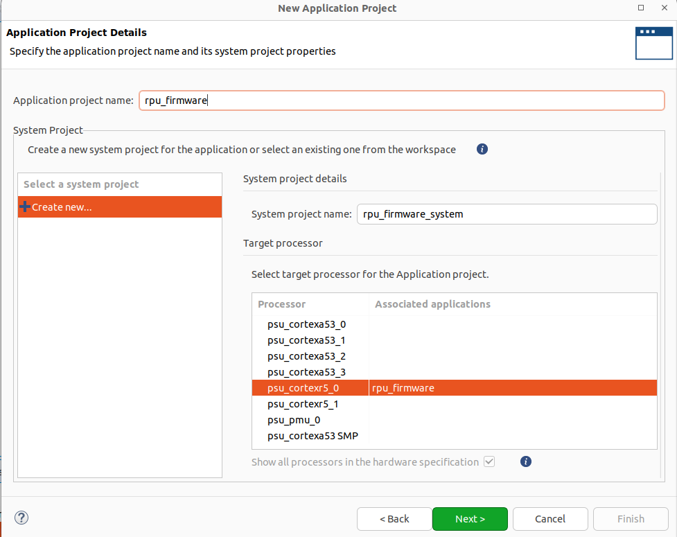
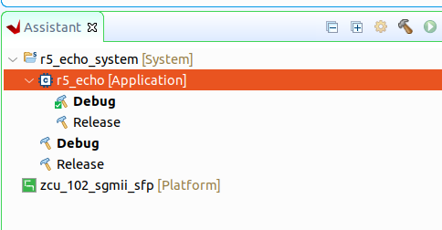
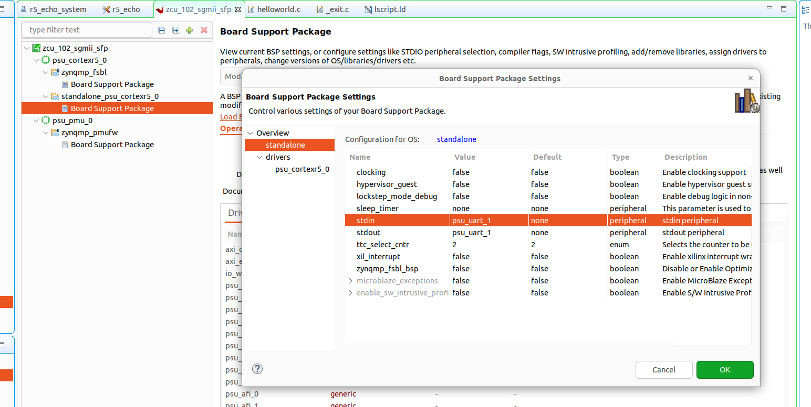
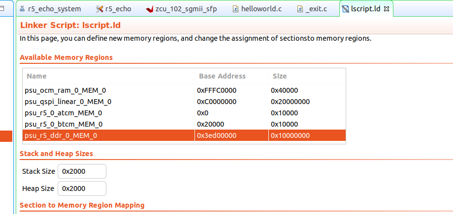
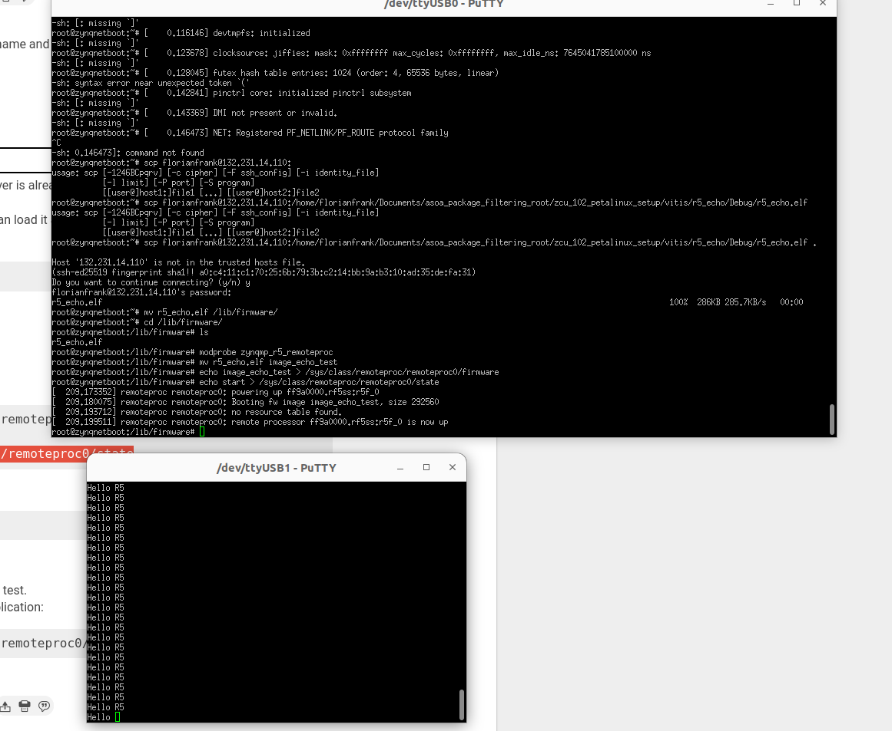

# ZCU102 PetaLinux Setup

This repository provides scripts and detailed instructions for configuring, building, and flashing PetaLinux using a custom exported hardware design.

Tested on Ubuntu 22.04.

## Setup Instructions

### 1. Download PetaLinux
- Download the PetaLinux installer from the official [Xilinx website (PetaLinux 2022.1)](https://www.xilinx.com/member/forms/download/xef.html?filename=petalinux-v2022.1-04191534-installer.run). This guide uses version 2022.1.

### 2. Prepare the Installation Directory
- Copy the installer to the desired installation folder. In this guide, we use `/opt/Xilinx/Petalinux` as the target directory.

### 3. Install PetaLinux
- First, install the required prerequisite packages:

    ```bash
    sudo apt-get install gcc-multilib

    # Add support for i386 packages
    sudo dpkg --add-architecture i386

    sudo apt-get install zlib1g:i386

    sudo apt-get install texinfo
    ```

> **Note**: Depending on your system, additional packages may be required.

### 4. Install PetaLinux
- **Important**: The PetaLinux installer will extract its files into the **current directory** without creating subdirectories. Make sure you are in the desired target directory before running the installer.

To install PetaLinux, run the following commands:

```bash
chmod +x petalinux-v2022.1-04191534-installer.run
./petalinux-v2022.1-04191534-installer.run
```
### 4. Configure PetaLinux

- To configure, build, and flash PetaLinux, you must first source the PetaLinux environment setup script:

    ```bash
    source /opt/Xilinx/Petalinux/settings.sh
    ```

- Navigate to the directory where you want to create your project and run the following commands:

    ```bash
    cd projectfolder
    source /opt/Xilinx/Petalinux/settings.sh

    # For Ultrascale+ devices, use 'zynqMP', and for Zynq-7000, use 'zynq'
    petalinux-create --type project --template zynqMP --name projectName
    cd projectfolder
    ```

---

### 5. Import Hardware Description and Customize the Build

- Import your exported hardware description file (refer to the following [repository](https://fimgit.fim.uni-passau.de/frankfl/zcu_102_gmii_sfp) for details):

    ```bash
    petalinux-config --get-hw-description ../hardware/zcu_102_sgmii_sfp.xsa
    ```
  

- Now, you can customize your PetaLinux build. For instance, to select the `axi_eth` network interface, navigate through the configuration menu:

    ```text
    Subsystem AUTO Hardware Settings -> Ethernet Settings -> Primary Ethernet -> axi_eth
    ```

    

- To adjust the root filesystem settings, navigate to:

    ```text
    Image Packaging Configuration -> Root Filesystem -> Select Type (EXT4 (SD/eMMC/SATA/USB))
    ```

    - For the device node, select `/dev/mmcblk0p2`, which represents the second partition on the SD card. (You may need to insert the SD card and manually create the two partitions, as detailed in Step 8.1) With this selection all the data created within the petalinux instance is stored on the second SD-card partition.

- If you do **not** wish to use a TFTP server, disable the option to *"Copy final images to tftpboot directory"* by pressing `n`.


Finally save the configiguration and exit the menu.


### 6. Configure U-Boot

- To configure U-Boot, run the following command:

    ```bash
    petalinux-config -c u-boot
    ```

- Enable SD Card support by navigating through the menu:

    ```text
    Boot Options -> Media -> SD Support for booting from SD/EMMC
    ```


- Press `y` to enable SD Card support.

#### 6.1 Configure u-boot device tree

Furthermore the u-boot tree can be further customized within the file ` project-spec/meta-user/recipes-bsp/u-boot/files/platform-top.h`

TODO nochmals checken!

```c++
#define CONFIG_EXTRA_ENV_SETTINGS \
"autoload=no\0" \
"netstart=0x10000000\0"\
"kernelsize=0x2000000\0" \ 
"kernelstart=0x740000\0" \ 
"kernelstart_0=0x740000\0" \ 
"ipaddr=192.168.1.10\0" \
"default_bootcmd=run sdboot\0" \
""
```

autoload=no disables the TFTP network boot option on startup.


```shell
/include/ "system-conf.dtsi"
/ {

	reserved-memory {
		#address-cells = <2>;
		#size-cells = <2>;
		ranges;
		rpu0vdev0vring0: rpu0vdev0vring0@3ed40000 {
			no-map;
			reg = <0x0 0x3ed40000 0x0 0x4000>;
		};
		rpu0vdev0vring1: rpu0vdev0vring1@3ed44000 {
			no-map;
			reg = <0x0 0x3ed44000 0x0 0x4000>;
		};
		rpu0vdev0buffer: rpu0vdev0buffer@3ed48000 {
			no-map;
			reg = <0x0 0x3ed48000 0x0 0x100000>;
		};
		rproc_0_reserved: rproc@3ed00000 {
			no-map;
			reg = <0x0 0x3ed00000 0x0 0x40000>;
		};
	};


	tcm_0a@ffe00000 {
		no-map;
		reg = <0x0 0xffe00000 0x0 0x10000>;
		phandle = <0x40>;
		status = "okay";
		compatible = "mmio-sram";
		power-domain = <&zynqmp_firmware 15>;
	};

	tcm_0b@ffe20000 {
		no-map;
		reg = <0x0 0xffe20000 0x0 0x10000>;
		phandle = <0x41>;
		status = "okay";
		compatible = "mmio-sram";
		power-domain = <&zynqmp_firmware 16>;
	};


	rf5ss@ff9a0000 {
		compatible = "xlnx,zynqmp-r5-remoteproc";
		xlnx,cluster-mode = <1>;
		ranges;
		reg = <0x0 0xFF9A0000 0x0 0x10000>;
		#address-cells = <0x2>;
		#size-cells = <0x2>;

		r5f_0 {
			compatible = "xilinx,r5f";
			#address-cells = <2>;
			#size-cells = <2>;
			ranges;
			sram = <0x40 0x41>;
			memory-region = <&rproc_0_reserved>, <&rpu0vdev0buffer>, <&rpu0vdev0vring0>, <&rpu0vdev0vring1>;
			power-domain = <&zynqmp_firmware 7>;
			mboxes = <&ipi_mailbox_rpu0 0>, <&ipi_mailbox_rpu0 1>;
			mbox-names = "tx", "rx";
		};
	};


	zynqmp_ipi1 {
		compatible = "xlnx,zynqmp-ipi-mailbox";
		interrupt-parent = <&gic>;
		interrupts = <0 29 4>;
		xlnx,ipi-id = <7>;
		#address-cells = <1>;
		#size-cells = <1>;
		ranges;

		/* APU<->RPU0 IPI mailbox controller */
		ipi_mailbox_rpu0: mailbox@ff990600 {
			reg = <0xff990600 0x20>,
			      <0xff990620 0x20>,
			      <0xff9900c0 0x20>,
			      <0xff9900e0 0x20>;
			reg-names = "local_request_region",
				    "local_response_region",
				    "remote_request_region",
				    "remote_response_region";
			#mbox-cells = <1>;
			xlnx,ipi-id = <1>;
		};
	};

serial@ff010000 {
                 status = "disabled";
                };
aliases {
                /delete-property/ serial1;
        };
};

/delete-node/ &uart1;
```

The `system-user.dtsi` file defines memory regions and their roles in the system for the ZCU102 Evaluation Board. 

##### 6.1.1 Memory configuration (reserved-memory)

This configuration ensures that specific memory regions are reserved for hardware subsystems, preventing conflicts with regular system memory.

```
	reserved-memory {
		#address-cells = <2>;
		#size-cells = <2>;
		ranges;
		rpu0vdev0vring0: rpu0vdev0vring0@3ed40000 {
			no-map;
			reg = <0x0 0x3ed40000 0x0 0x4000>;
		};
		rpu0vdev0vring1: rpu0vdev0vring1@3ed44000 {
			no-map;
			reg = <0x0 0x3ed44000 0x0 0x4000>;
		};
		rpu0vdev0buffer: rpu0vdev0buffer@3ed48000 {
			no-map;
			reg = <0x0 0x3ed48000 0x0 0x100000>;
		};
		rproc_0_reserved: rproc@3ed00000 {
			no-map;
			reg = <0x0 0x3ed00000 0x0 0x40000>;
		};
	};
  ```

- **rpu0vdev0vring0** & **rpu0vdev0vring1**:
  - **Size**: 16 kB each
  - **Purpose**: These regions are used for virtual ring buffers, facilitating communication between the Application Processing Unit (APU) and the Real-time Processing Unit (RPU).

- **rpu0vdev0buffer**:
  - **Size**: 1 MB
  - **Purpose**: This region holds data exchanged between the cores (APU and RPU) through interprocessor communication (IPC).

- **rproc_0_reserved**:
  - **Size**: 256 kB
  - **Purpose**: Reserved for the RPU's remote processor operations, storing essential code or data needed during runtime execution.


##### 6.1.2 TCM (Tightly Coupled Memory) Configuration

**tcm_0a and tcm_0b:** These blocks define memory regions (0xffe00000 and 0xffe20000, each 64 KB) for tightly coupled memory used by the RPU cores. TCM is fast, low-latency memory for high-performance real-time tasks. The compatible = "mmio-sram" property indicates these are memory-mapped SRAM regions.

```
	tcm_0a@ffe00000 {
		no-map;
		reg = <0x0 0xffe00000 0x0 0x10000>;
		phandle = <0x40>;
		status = "okay";
		compatible = "mmio-sram";
		power-domain = <&zynqmp_firmware 15>;
	};

	tcm_0b@ffe20000 {
		no-map;
		reg = <0x0 0xffe20000 0x0 0x10000>;
		phandle = <0x41>;
		status = "okay";
		compatible = "mmio-sram";
		power-domain = <&zynqmp_firmware 16>;
	};
```

##### 6.1.3 R5 (RPU) Remote Processor (rf5ss@ff9a0000)

- **r5f_0:** The RPU core is marked as compatible with the xilinx,r5f processor and is associated with multiple memory regions for operation, including the reserved memory, VirtIO buffers, and virtual ring buffers defined earlier.
- The power-domain and mailbox properties manage power control and communication via the IPI mechanism with the APU.

```shell
		r5f_0 {
			compatible = "xilinx,r5f";
			#address-cells = <2>;
			#size-cells = <2>;
			ranges;
			sram = <0x40 0x41>;
			memory-region = <&rproc_0_reserved>, <&rpu0vdev0buffer>, <&rpu0vdev0vring0>, <&rpu0vdev0vring1>;
			power-domain = <&zynqmp_firmware 7>;
			mboxes = <&ipi_mailbox_rpu0 0>, <&ipi_mailbox_rpu0 1>;
			mbox-names = "tx", "rx";
		};
	};
```

##### 6.1.4  IPI Mailbox (zynqmp_ipi1)

This section defines the Inter-Processor Interrupt (IPI) mechanism, which facilitates communication between the APU and RPU cores:

```
	zynqmp_ipi1 {
		compatible = "xlnx,zynqmp-ipi-mailbox";
		interrupt-parent = <&gic>;
		interrupts = <0 29 4>;
		xlnx,ipi-id = <7>;
		#address-cells = <1>;
		#size-cells = <1>;
		ranges;

		/* APU<->RPU0 IPI mailbox controller */
		ipi_mailbox_rpu0: mailbox@ff990600 {
			reg = <0xff990600 0x20>,
			      <0xff990620 0x20>,
			      <0xff9900c0 0x20>,
			      <0xff9900e0 0x20>;
			reg-names = "local_request_region",
				    "local_response_region",
				    "remote_request_region",
				    "remote_response_region";
			#mbox-cells = <1>;
			xlnx,ipi-id = <1>;
		};
	};
```

- ipi_mailbox_rpu0: Defines the memory regions associated with the APU-to-RPU IPI mailbox, allowing inter-core messaging between the RPU and APU. The mboxes and mbox-names properties define the communication channels ("tx" and "rx").

##### 6.1.5  Remove UART 1 from the device tree


To enable the R5 core to use the second UART interface, we need to remove the UART1 configuration from the A53’s device tree. This is done by adding the following lines to the system-user.dtsi file:

```
serial@ff010000 {
                 status = "disabled";
                };
aliases {
                /delete-property/ serial1;
        };
};

/delete-node/ &uart1;
```

---

Now you can copy the `system-user.dtsi` file to the following directory within your project:

```
project-spec/meta-user/recipes-bsp/device-tree/files
```


rebuild with 

```bash
$ petalinux-build -c u-boot
```


Doku for: 

```
#define CONFIG_EXTRA_ENV_SETTINGS \
	"autoload=no\0" \
	"netstart=0x10000000\0"\
	"kernelsize=0x2000000\0" \ 
	"kernelstart=0x740000\0" \ 
	"kernelstart_0=0x740000\0" \ 
	"cp_kernel2ram=sf probe 0 && sf read ${netstart} ${kernelstart} ${kernelsize}\0" \
	"default_bootcmd=run cp_kernel2ram && bootm ${netstart}\0" \
""
```

### 7. Add a Custom Application

To add a custom application to your PetaLinux project, use the following command:

```bash
$ petalinux-create -t apps --template c++ --name myapp --enable
```

This command creates an application named `myapp`. Ensure the application name is in lowercase to avoid potential warnings like:

```
WARNING: QA Issue: PN: embeddedRTPS is upper case, this can result in unexpected behavior. [uppercase-pn]
```

The generated files for your application will be located in:

```bash
./project-spec/meta-user/recipes-apps/myapp
```

Within the `myapp.bb` file (the BitBake recipe for your application), you can configure various build settings. Below is an example of the contents:

```c++
#
# This file is the myapp recipe.
#

SUMMARY = "Simple emyapp application"
SECTION = "PETALINUX/apps"
LICENSE = "MIT"
LIC_FILES_CHKSUM = "file://${COMMON_LICENSE_DIR}/MIT;md5=0835ade698e0bcf8506ecda2f7b4f302"

SRC_URI = "file://myapp.cpp \
           file://Makefile \
		  "

S = "${WORKDIR}"

do_compile() {
	     oe_runmake
}

do_install() {
	     install -d ${D}${bindir}
	     install -m 0755 myapp ${D}${bindir}
}
```

In the files directory, you will find `myapp.cpp` and a `Makefile` that you can modify to configure your application.


### 7 . Configure the kernel

To configure the Linux kernel in your PetaLinux project, use the following command:

```bash
$ petalinux-config -c kernel
```

This command opens the kernel configuration menu. For now, we will leave all settings at their default values. However, it's worth taking the time to explore the various menus to familiarize yourself with the available options.

Go to Device Drivers -> Device Drivers -> Remote proc drivers

### 6. Configure Root Filesystem (RootFS)

To configure the root filesystem, run the following command:

```bash
$ petalinux-config -c rootfs
```

To include the custom application created earlier (e.g., `myapp`), navigate to:


```bash
Under apps -> myapp 
```

Select `myapp` to ensure it is automatically compiled and included in the build image.


Additionally, you can select other packages under PetaLinux Package Groups, such as support for X11, Qt, or Python.

### 7. Build PetaLinux

Now that all settings have been configured, you can build the PetaLinux project by running the following command:


```bash
$ petalinux-build

[INFO] Sourcing buildtools
[INFO] Building project
[INFO] Sourcing build environment
[INFO] Generating workspace directory
INFO: bitbake petalinux-image-minimal
NOTE: Started PRServer with DBfile: /home/florianfrank/Documents/asoa_package_filtering_root/zcu_102_petalinux_setup/zynq_netboot/build/cache/prserv.sqlite3, Address: 127.0.0.1:43887, PID: 275754
WARNING: Host distribution "ubuntu-22.04" has not been validated with this version of the build system; you may possibly experience unexpected failures. It is recommended that you use a tested distribution.
Loading cache: 100% |##############################################################################################################################################################| Time: 0:00:00
Loaded 5391 entries from dependency cache.
Parsing recipes: 100% |############################################################################################################################################################| Time: 0:00:00
Parsing of 3594 .bb files complete (3589 cached, 5 parsed). 5396 targets, 509 skipped, 0 masked, 0 errors.
NOTE: Resolving any missing task queue dependencies
#########################################################################################################################################################| Time: 0:00:06
INFO: Successfully copied built images to tftp dir: /var/lib/tftpboot
[INFO] Successfully built project
```

You should see the following output. In this example, the TFTP boot option was enabled, which automatically copies the build artifacts to `/var/lib/tftpboot`.

Additionally, a new directory named `/images/linux/` will be created, containing all the necessary build files for your project.

### 9. Create a bootable package

To generate all the necessary files for booting the system, run the following command:

```bash
$ petalinux-package --boot --u-boot images/linux/u-boot.elf --dtb images/linux/system.dtb --fsbl images/linux zynqmp_fsbl.elf --fpga images/linux/system.bit
```

This command creates the `BOOT.BIN` file. However, if a `BOOT.BIN` already exists (for example, after rebuilding the system), the command will fail.

To handle this, you can run the following script from your default project folder to automatically remove the previous BOOT.BIN and generate a new one:

```bash
$ ../build_boot.sh
```

This script ensures that any old `BOOT.BIN` is deleted before creating a new one, preventing build errors.

### 8. Booting the device

# Booting the Device

There are several methods to boot your device. Below, we outline three common approaches:

1. **Booting with JTAG and the Hardware Server**  
   This method uses JTAG and the hardware server to load and run the system directly from your host machine.

2. **Booting from an SD Card**  
   You can boot your system by creating a bootable SD card containing the required files, such as `BOOT.BIN` and the root filesystem.

3. **Booting via TFTP with NFS as the Root Filesystem**  
   This method involves using TFTP to load the kernel and using NFS to mount the root filesystem over the network.

Each method offers different advantages depending on your setup and requirements.

#### 8.1 Boot Petalinux via JTAG 

To boot your device via JTAG, follow these steps. Make sure you are in your current project folder.

Before proceeding, ensure that **Vivado** is not running an active connection to the hardware server. If Vivado is open and connected, go to the **Hardware Manager** and disconnect the device.


Afterwards, launch the hardware server by running the following command:

```bash
$ /opt/Xilinx/Petalinux/tools/xsct/bin/hw_server
```

> **Note**: Run this command in a separate terminal tab because the hardware server process blocks the terminal.

To configure the ZCU102 for JTAG boot, set the **SW6** pins to `0000`, as shown in the following figure.


After setting the device to JTAG mode, connect **UART** and **JTAG** to your PC using a micro USB cable. You should see multiple UART ports, typically `/dev/ttyUSB0` through `/dev/ttyUSB3`.


Use a terminal tool of your choice to connect to `/dev/ttyUSB0` with the following configuration:

- **Baudrate**: 115200
- **Stopbits**: 1
- **Data Bits**: 8 bits
- **Parity**: None

In this example, we used **PuTTY**, configured as shown below, and pressed "Connect":


Afterwards return to the project folder and execute the following command in your project folder:

```bash
$ petalinux-boot --jtag --fpga --kernel --hw_server-url TCP:127.0.0.1:3121

[INFO] Sourcing buildtools
INFO: Use bitstream: "/home/florianfrank/Documents/asoa_package_filtering_root/zcu_102_petalinux_setup/zynq_netboot/images/linux/system.bit.
INFO: Please use --fpga --bitstream <BITSTREAM> to specify a bitstream if you want to use other bitstream.
INFO: Launching XSDB for file download and boot.
INFO: This may take a few minutes, depending on the size of your image.
rlwrap: warning: your $TERM is 'xterm-256color' but rlwrap couldn't find it in the terminfo database. Expect some problems.: Inappropriate ioctl for device
INFO: Configuring the FPGA...                                                                                                                                                                                                                 
INFO: Downloading bitstream: /home/florianfrank/Documents/asoa_package_filtering_root/zcu_102_petalinux_setup/zynq_netboot/images/linux/system.bit to the target.
INFO: Downloading ELF file: /home/florianfrank/Documents/asoa_package_filtering_root/zcu_102_petalinux_setup/zynq_netboot/images/linux/pmufw.elf to the target.                                                                               
INFO: Downloading ELF file: /home/florianfrank/Documents/asoa_package_filtering_root/zcu_102_petalinux_setup/zynq_netboot/images/linux/zynqmp_fsbl.elf to the target.                                                                         
INFO: Loading image: /home/florianfrank/Documents/asoa_package_filtering_root/zcu_102_petalinux_setup/zynq_netboot/images/linux/system.dtb at 0x00100000                                                                                      
INFO: Downloading ELF file: /home/florianfrank/Documents/asoa_package_filtering_root/zcu_102_petalinux_setup/zynq_netboot/images/linux/u-boot.elf to the target.                                                                              
INFO: Loading image: /home/florianfrank/Documents/asoa_package_filtering_root/zcu_102_petalinux_setup/zynq_netboot/images/linux/Image at 0x00200000                                                                                           
INFO: Loading image: /home/florianfrank/Documents/asoa_package_filtering_root/zcu_102_petalinux_setup/zynq_netboot/images/linux/boot.scr at 0x20000000                                                                                        
INFO: Downloading ELF file: /home/florianfrank/Documents/asoa_package_filtering_root/zcu_102_petalinux_setup/zynq_netboot/images/linux/bl31.elf to the target.
INFO: Enter booti 0x00200000 - 0x00100000 in uboot terminal if auto boot fails       
```

This process may take some time. Once completed, you should see output in the PuTTY console.


Ensure that the root filesystem is set to `INTRMFS`. If you select `ext (eMMC)`, an SD card must be present. As explained in the next step, if the SD card is correctly inserted, you can start the operating system with the following command:

```
zynq> boot
```

Once the kernel has booted, the console output should look like this:


When logging in for the first time, use the username `petalinux`. You will be prompted to change the password immediately.


####  8.1 Booting Petalinux via SD Card

##### 8.1.1 Partition the SD-Card

To boot PetaLinux from an SD card, you need a card with at least 8 GB of space. Follow these steps to partition the SD card:

- **Partition 1**:
  - **Size**: 1 GB
  - **Format**: FAT
  - **Name**: BOOT

- **Partition 2**:
  - **Size**: At least 7 GB
  - **Format**: ext4
  - **Name**: rootfs

You can use the Ubuntu Disk Utility to create these partitions:


After partitioning, check the name of the device file for the second partition. Look for the name marked with a red rectangle:


##### 8.1.1 Copy files to the SD-Card

The following files from `image/linux` must be copied to the BOOT partition: 

- **BOOT.BIN:** Boot image contains following crucial components: 
    - **First Stage Bootloader (FSBL):** Initializes Hardware components such as memory, clock configuration peripherals and loads the next stage in the boot process (in our case the u-boot bootloader).
    - **Bitstream:** Contains the previous selected bitstream flashing the design on the PL. (In our case, if you see the lEDs next to SW13 blinking, the bitstream was sucessfully flashed to the device.)
    - **U-Boot:** Secondary bootloader whcih is loading the linux kernel, device tree and root file system

- **boot.scr:** Contains the boot commands writen to the u-boot bootloader. You can open the file with your text editor and have a look there and will find a specification of the used files, as well as the boot order and boot targets, such as mmc0 and mmc1 for the SD-Card, jtag, or QSPI

    ```
    fitimage_name=image.ub
    kernel_name=Image
    ramdisk_name=ramdisk.cpio.gz.u-boot
    rootfs_name=rootfs.cpio.gz.u-boot


    for boot_target in ${boot_targets};
    do
        echo "Trying to load boot images from ${boot_target}"
        if test "${boot_target}" = "jtag" ; then
            booti 0x00200000 0x04000000 0x00100000
        fi
        if test "${boot_target}" = "mmc0" || test "${boot_target}" = "mmc1" || test "${boot_target}" = "usb0" || test "${boot_target}" = "usb1"; then
            if test -e ${devtype} ${devnum}:${distro_bootpart} /uEnv.txt; then
                fatload ${devtype} ${devnum}:${distro_bootpart} 0x00200000 uEnv.txt;
                echo "Importing environment(uEnv.txt) from ${boot_target}..."
                env import -t 0x00200000 $filesize
                if test -n $uenvcmd; then
                    echo "Running uenvcmd ...";
                    run uenvcmd;
                fi
            fi
        ....
    ```

- **image.ub:** Flattened Image Tree File it packages multiple boot components (kernel, device tree, etc. )
    - Contains following components: 
        - The Linux kernel
        - Device Tree Blob: Binary description of the hardware like processors and peripherals required fo rthe kernel to understand the specific board configuration
        - Initramfs (optional): temporary root file system loaded into the memory and used for kernel during boot before actual root filesystem is mounted. 

To copy these files, you can either use the `cp` command manually or execute our provided script:

```bash
$ ./create_sd_card.sh
```

This script will also create the root file system, which can either be unpacked on the rootfs partition of the SD-card by copying rootfs.tar.gz and unzipping it: 

```bash
$ tar xvzf rootfs.tar.gz
```

Or as part of the create_sd_card script, you can use the dd command to create a image: 

```bash
sudo dd if=images/linux/rootfs.ext4 of=/dev/mmcblk0p2 status=progress
```

>**Important**: Ensure that the device file `/dev/mmcblk0p2` corresponds to the second partition of your SD card.


##### 8.1.2 Boot from the SD card 

To boot from the SD card, follow these steps:

1. **Set SW6 to Boot Mode**: Configure SW6 to the `0111` position, as shown in the figure below:

    

2. **Insert the SD Card**: Place the prepared SD card into the SD card slot.

3. **Power On the Board**: Switch on the board by toggling SW1.

4. **Interact via UART Console**: Continue with the setup using the UART console, as described in Section 8.1.

### 9. Steps to build the RPU firmware

1. **Open Vitis:**
   - Launch Vitis IDE via Vivado by navigating to **Tools -> Launch Vitis IDE**.

2. **Create a New Application:**
   - Go to **File -> New -> Application**.

3. **Select Platform from XSA:**
   - Choose the option **"Create a new platform from XSA"** and select the previously exported XSA file.
   - Choose **`psu_cortexr5_0`** as the processor and click **Next**.
   - On the next screen, again select **`psu_cortexr5_0`**, and assign a name to your application.

   

4. **Configure the Application:**
   - Click **Next** without making any changes.
   - On the next screen, choose a sample application to build, such as **Hello World**.
   - Click **Finish**.

5. **Modify BSP Settings:**
   - On the left side, in the **Assistant Window**, find your application and right-click to select **"Navigate to BSP Settings"**.

   

6. **Set Up UART in BSP:**
   - In the **BSP Settings**, under **`standalone_psu_cortexr5_0`**, select **Board Support Package** and click **Modify BSP Settings**.
   - Go to the **Standalone** tab and set both **stdin** and **stdout** to **`psu_uart_1`**.

   

7. **Update Linker Script:**
   - Exit the BSP menu and navigate to the `src` folder of your project.
   - Open the linker script (`ldscript.ld`).

   To prevent memory overlap between the R5 and A53 processors in the shared DRAM, modify the base address of **`psu_r5_ddr_0_MEM_0`** to map it to the memory area defined in the device tree as `rproc_0_reserved`:

   ```dts
   rproc_0_reserved: rproc@3ed00000 {
       no-map;
       reg = <0x0 0x3ed00000 0x0 0x40000>;
   };
   ```

   

We can keep the remaining settings unchanged and build our application:

```shell
17:00:43 **** Incremental Build of configuration Debug for project r5_echo ****
make all 
Building target: r5_echo.elf
Invoking: ARM R5 gcc linker
armr5-none-eabi-gcc -mcpu=cortex-r5  -mfloat-abi=hard  -mfpu=vfpv3-d16 -Wl,-T -Wl,../src/lscript.ld -L/home/florianfrank/Documents/asoa_package_filtering_root/zcu_102_petalinux_setup/vitis/zcu_102_sgmii_sfp/export/zcu_102_sgmii_sfp/sw/zcu_102_sgmii_sfp/standalone_psu_cortexr5_0/bsplib/lib -o "r5_echo.elf" ./src/helloworld.o ./src/platform.o   -Wl,--start-group,-lxil,-lgcc,-lc,--end-group
Finished building target: r5_echo.elf
 
Invoking: ARM R5 Print Size
armr5-none-eabi-size r5_echo.elf  |tee "r5_echo.elf.size"
   text	   data	    bss	    dec	    hex	filename
   7280	   1528	  22572	  31380	   7a94	r5_echo.elf
Finished building: r5_echo.elf.size
 

17:00:43 Build Finished (took 167ms)
```

You should see the output above. Locate the generated ELF file, named `r5_echo.elf`, in the *Release* or *Debug* folder of your project.

### 9. Start the RPU from Petalinux

After starting petalinux, as explained in Section 8, make sure you have a folder `/sys/class/remoteproc/remoteproc0`available. If this is not case you probably have missconfigured the device tree as explained in Section 6.1 

  - 9.1 Check if remoteproc is available:

    ```bash
    # ls /sys/class/remoteproc/remoteproc0
    coredump dev device firmware name power recovery state subsystem uevent
    ```

    - **coredump:** This file or directory is used for accessing the core dump of the remote processor. A core dump is a file that captures the memory contents of a running process at a specific point in time, usually when the process crashes.

    - **dev:** This file or directory represents the device node associated with the remote processor. It can be used to interact with the hardware device.

    - **device:** This file or directory provides information about the device associated with the remote processor. It may contain attributes such as the device name or other metadata.

    - **firmware:** This file or directory is used to load or interact with the firmware for the remote processor. Firmware is the software that is embedded in the hardware to control its operations.

    - **name:** This file contains the name of the remote processor as recognized by the system.

    - **power:** This directory or file is used to manage power states and control power-related operations for the remote processor.

    - **recovery:** This file or directory might be related to recovery operations or states of the remote processor, such as recovery from a fault or error.

    - **state:** This file indicates the current state of the remote processor (e.g., running, stopped, or suspended).

    - **subsystem:** This file or directory provides information about the subsystem to which the remote processor belongs.

    - **uevent:** This file provides information about uevents (userspace events) related to the remote processor. Uevents are used by the kernel to send notifications about changes in device state to userspace.

  - 9.2 Load the Remote Processor Kernel Module

    The `zynqmp_r5_remoteproc` kernel module is required to manage the R5 processors as specified in the device tree.

    To load the module, use the following command:

    ```bash
    modprobe zynqmp_r5_remoteproc
    ```

    If the command executes successfully, it will not produce any output.


  - 9.3 Copy the Firmware to Your Device

    To use the R5 processors, you need to copy the firmware to your device. You can do this in several ways. One common method is to use scp after obtaining the IP address from the axi_ethernet interface. Another way is directly adding it to the rootfs on the SD-card.

    The firmware must be copied to a folder `/lib/firmware`. 
    Simply remove the .elf prefix from the file. 

  - 9.4 Select your kernel module by executing 

    ```
    echo r5_echo > /sys/class/remoteproc/remoteproc0/firmware
    ``` 

  - 9.5 Start the Firmware

  Start the firmware with the following command. Ensure that you have a terminal open on `/dev/ttyUSB1` using the settings specified in Section 8.1.

    ```
      echo start > /sys/class/remoteproc/remoteproc0/state
    ```

  After executing this command, check the status of the remote processor by running:

  ```
  # cat /sys/class/remoteproc/remoteproc0/state
  ```

  you should see `running`.


   

  At this point, you should be able to see the RPU output on /dev/ttyUSB1.


  - 9.6 Stop the Firmware

  To stop the firmware just execute


    ```
      echo stop > /sys/class/remoteproc/remoteproc0/state
    ```